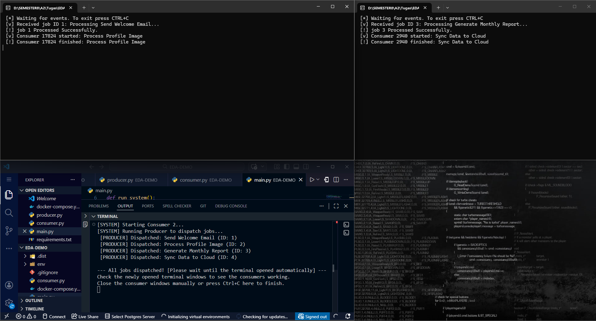

# Event-Driven Architecture (EDA) Demo with RabbitMQ

Repositori ini berisi implementasi sistem **Event-Driven Architecture (EDA)** sederhana menggunakan **RabbitMQ** sebagai message broker. Proyek ini mendemonstrasikan bagaimana komunikasi asynchronous bekerja antara *Producer* dan *Consumer*.

## 👤 Identitas Mahasiswa
* **Nama:** Rakha Davin Bani Alamsyah
* **NPM:** 2206082650
* **GitHub:** [rakhadavin/AAQ-Tugas2-EDA_DEMO](https://github.com/rakhadavin/AAQ-Tugas2-EDA_DEMO.git)

---

## 🚀(How to Run)

1.  **Instalasi Dependensi:**
    ```bash
    pip install -r requirements.txt
    ```

2.  **Menjalankan Aplikasi:**
    Jalankan file `main.py` dari dalam folder `EDA-DEMO`. (Consumer dan Producer files akan dijalankan secara otomatis melalui file ini)
    ```bash
    python main.py
    ```

3.  **Observasi:**
    Tunggu hingga terminal terbuka secara otomatis untuk melihat log proses pengiriman dan penerimaan pesan.

---

## 📊 Dokumentasi Implementasi

### 1. Bukti Eksekusi

*Gambar di atas menunjukkan interaksi real-time antara dispatching pesan oleh Producer dan pemrosesan oleh Consumer.*

Bukti bahwa 1 Producer bisa didengarkan oleh multi-consumer.

---

### 2. Alur Kerja Event-Driven (Demonstrasi)

Sistem ini menggunakan RabbitMQ untuk mengelola siklus hidup pesan sebagai berikut:

#### **A. Pengiriman Event (Publishing)**
* **`producer.py`** bertindak sebagai pengirim tugas. File ini akan mengirim data dalam bentuk JSON.
* **How It Works : ** Pesan dikirim menggunakan metode `basic_publish` ke sebuah **Exchange**, yang kemudian diteruskan ke antrean (Queue) bernama `task_distribution`.
```
 channel.basic_publish(
        exchange='',
        routing_key='task_distribution', --> mengarahkan antrean ke queue bernama task_dsitribution
        body=message, --> data yang dikirim dalam bentuk JSON
        properties=pika.BasicProperties(
            delivery_mode=2,  # make message persistent
        ))
        
        ```


#### **B. Penyimpanan dalam Queue (Buffering)**
* **Durability:** Queue diatur dengan `durable=True` dan pesan menggunakan `delivery_mode=2` sebagai impleentasi backup data (penyimpanan internal RabbitMQ), sehingga meskipun consumer sedang inactive, pesan akan tetap disimpan oleh broker sehingga ketika consumer aktif kembali pesan yang berada pada antrean dapat diproses atau ditampilkan.

Selain  `delivery_mode=2` , terdapat mode delivery lain:
 1. `delivery_mode=1` (Transient) : Default mode, dimana pesan  hanya akan disimpan pada RAM atau penyimpanan fisik komputer, sehingga data rentan hilang jika consumer tidak aktif. Cocok untuk keperluan Real-time data processing. 

Selain itu `delivery_mode=2` juga harus dilengkapi dengan syntax `durable=true`, dimana hal ini bertujuan menyiapkan penyimpanan internal sendiri pada RabbitMQ. Jika `durable=false`, maka delivery mode  = 2 akan gugur, karena penyimpanan hanya berdasarkan RAM saja.

#### **C. Pemrosesan Real-Time (Consuming)**
* **Push Model:** RabbitMQ secara aktif mendorong pesan ke Consumer yang tersedia.
* **Fair Dispatch (QoS):** Menggunakan `prefetch_count=1`.`prefetch_count=n` dimaksudkan agar Consumer tidak mengambil beban berlebih (hanya n pesan dalam satu waktu untuk 1 consumer). Hal ini dapar dimanfaatkan untuk Load Balancing, yang dapat :
1. **Mengurangi beban consumer**
2. **Optimasi sumber daya** 
3. **Memaksimalkan kinerja masing-masing consumer**
4. **Efisiensi waktu tunggu akibat pemrosesan **

* **Acknowledgment (ACK):** Pesan hanya akan dihapus dari antrean setelah Consumer mengirimkan sinyal `basic_ack` (setelah proses selesai).

---

### 3. Analisis Mekanisme Asynchronous

Mekanisme ini bekerja berdasarkan prinsip **Decoupling** (Pelepasan Keterkaitan):

1.  **Temporal Decoupling:** Pengirim dan penerima tidak harus aktif bersamaan. Broker bertindak sebagai penyangga (buffer).
2.  **Fire and Forget:** Producer tidak perlu menunggu hasil pemrosesan Consumer. Setelah pesan diterima Broker, Producer bebas melakukan tugas lain. Sementara, proses akan dilakukan di latar belakang, sehingga user lebih dahulu mendapat kepastian atau jawaban.
3.  **Pull/Push Balance:** Consumer mengatur kecepatannya sendiri dalam mengambil tugas, sehingga sistem tetap stabil meski terjadi lonjakan trafik.

---

### 4. Perbandingan: Event-Driven vs. Request-Response

Berikut adalah perbedaan utama antara komunikasi **Asynchronous** (proyek ini) dengan **Synchronous** (HTTP/REST) tradisional:

| Karakteristik | Request-Response (HTTP/REST) | Event-Driven (RabbitMQ/Kafka) |
| :--- | :--- | :--- |
| **Ketergantungan** | **Tight Coupling:** Pengirim tertahan (blocking) menunggu respon. | **Loose Coupling:** Pengirim langsung lanjut setelah kirim ke broker. |
| **Resiliensi** | Jika server tujuan mati, request gagal (Error 500). | Jika consumer mati, pesan aman di antrean hingga consumer pulih. |
| **Beban Sistem** | Lonjakan trafik bisa membebani server secara instan. | Queue bertindak sebagai penyeimbang beban kerja. |
| **Analogi** | **Telepon:** Harus tersambung langsung agar komunikasi terjadi. | **WhatsApp:** Pesan dikirim sekarang, dibaca saat penerima sempat. |

---